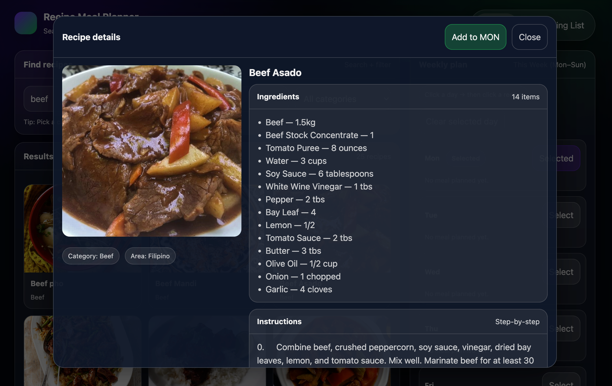
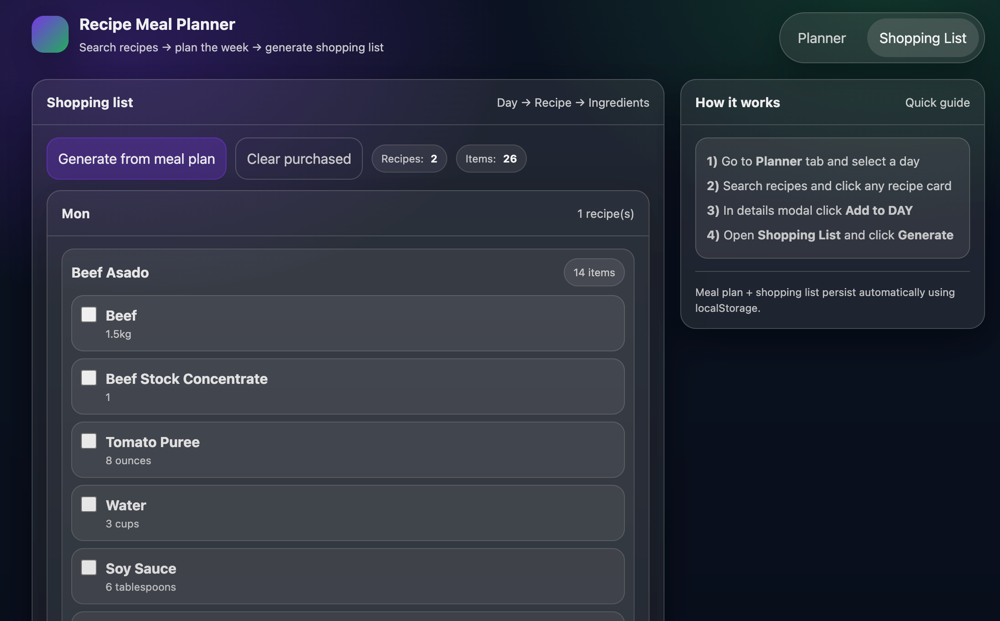
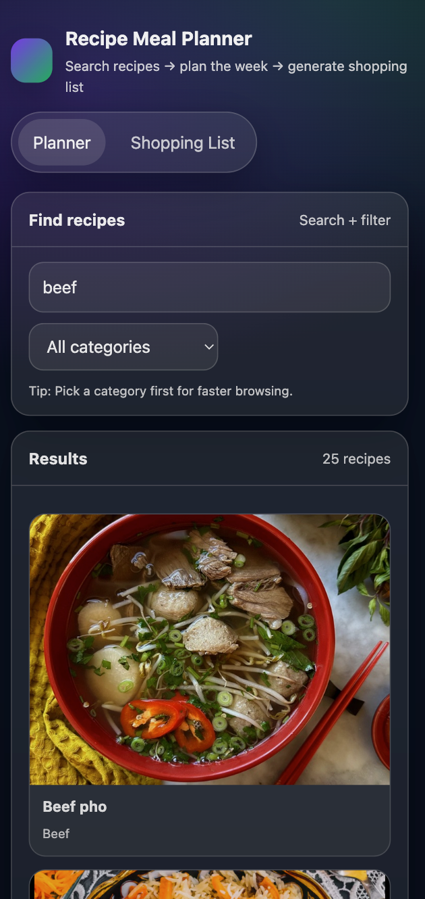

# Recipe Meal Planner

A React + TypeScript meal planning application that allows users to search recipes, plan meals for the week, and generate a shopping list based on planned meals.

---

## Live Demo

https://recipe-meal-planner-web-app-ft7t.vercel.app/

---

## GitHub Repository

https://github.com/jalishmahmud/recipe-meal-planner-web-app

---

## Setup & Run

### Prerequisites
- **Node.js:** v22.14.0
- **npm:** 10.9.2

### Installation
```bash
git clone https://github.com/jalishmahmud/recipe-meal-planner-web-app.git
cd recipe-meal-planner-web-app
npm install

npm run dev
http://localhost:5173
npm run build
npm run type-check

## Architecture Overview
### Folder Structure
src/
├── components/        # Reusable UI components (ErrorBoundary, Header, RecipeDetailsModal, RecipeGrid, RecipeSearch, WeeklyMealPlan)
├── hooks/             # Custom hooks (useRecipes, useRecipeDetails, useMealPlan, useDebounce )
├── context/           # Context API + useReducer for global state
├── types/             # TypeScript interfaces and API response types
├── utils/             # API helpers, mappers, constants
├── App.tsx
└── main.tsx

### State Management Approach
```
Context API + useReducer

Centralized global state for:

- Weekly meal plan

- Shopping list

- Selected day

- Recipe details modal state

Chosen instead of Redux to keep the project lightweight, readable, and easy to maintain.


### Custom Hooks
1. useRecipes(searchQuery, category)

    Fetches recipes using:

    search.php (search by recipe name)

    filter.php (filter by category)

Features:

    Debounced search (500ms, minimum 3 characters)

    Category-first browsing

    AbortController to cancel in-flight requests

    Loading and error handling

2. useRecipeDetails(id)

    Fetches full recipe details via lookup.php

    Used inside the recipe details modal

    Handles loading, error, and abort scenarios

3. useMealPlan()

Manages:

    Weekly meal plan (Mon–Sun)

    Selected day

    Adding/removing meals

    Opening/closing recipe details modal

Persists data using localStorage

4. useDebounce()

    Debounced search (500ms, minimum 3 characters)


## Technical Decisions
Why these libraries & patterns?

    React + TypeScript for strong type safety and maintainability

    CSS Modules to avoid global style conflicts

    Context API + Reducer for predictable state updates without extra dependencies

## Trade-offs Made

    Did not include unit tests to prioritize core functionality

    UI focuses on usability and responsiveness rather than pixel-perfect design

    Used native browser APIs instead of third-party debounce libraries

## Improvements with More Time

    Add unit tests for hooks and reducers

    Add loading skeletons instead of spinners

    Improve accessibility (ARIA roles, keyboard navigation)

    Add drag-and-drop support for meal planning

# Time Breakdown
    | Task              | Time Spent    |
| ----------------- | ------------- |
| Setup & structure | 2 hrs       |
| Custom hooks      | 4 hrs         |
| State management  | 2 hrs         |
| UI components     | 5 hrs         |
| API integration   | 3 hrs         |
| Testing & fixes   | 2 hrs         |
| **Total**         | **~18 hours** |

## Challenges Faced
1. Inconsistent API response shapes

    Different endpoints (search, filter, lookup) return different data

    Solved by defining strict TypeScript types and mapping functions

2. Search & category interaction

    Category needed to work independently while still allowing text search

    Solved by resetting search input on category change and debouncing the query

## Screenshots





